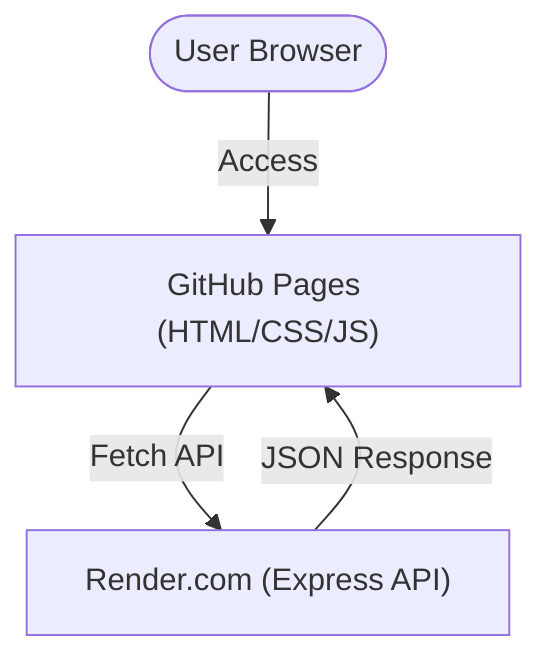

# Drip Coffee Recipe App

## 📖 Overview
このアプリは、入力した条件（焙煎度、味、温度、抽出量など）に基づいて  
ドリップコーヒーの抽出レシピを提案する Web アプリです。  

- **Frontend**: GitHub Pages で公開  
- **Backend**: Render.com (Express API) で公開  
- ユーザーはブラウザ上でフォーム入力するだけで、最適なレシピを取得できます。

---

## 🛠️ Architecture


---

## 🌐 Components

### Frontend (GitHub Pages)
- 静的ファイル (HTML / CSS / JavaScript) をホスティング  
- フォーム入力を受け取り、バックエンド API にリクエスト  

### Backend (Render.com)
- Node.js / Express ベースの API  
- `/get-recipe` エンドポイントでレシピを返却  
- CORS 設定済みで GitHub Pages からのアクセスを許可  

---

## 🚀 Usage
1. [GitHub Pages の URL] にアクセス  
2. フォームに焙煎度、味、温度、抽出量を入力  
3. 「Submit」をクリック  
4. 提案されたレシピと抽出ステップが表示されます  

---

## 📂 Repository Structure
```
.
├── docs/   # フロントエンド (GitHub Pages にデプロイ)
│   ├── index.html
│   ├── styles.css
│   └── app.js
│
├── backend/    # バックエンド (Render.com にデプロイ)
│   ├── server.js
│   ├── routes/
│   └── data/
└── README.md
```

---

## 🌐 Deployment
- **Frontend (GitHub Pages)**: https://t-act.github.io/drip-coffee-recipe-app  
- **Backend (Render.com)**: https://drip-coffee-recipe-app.onrender.com  
